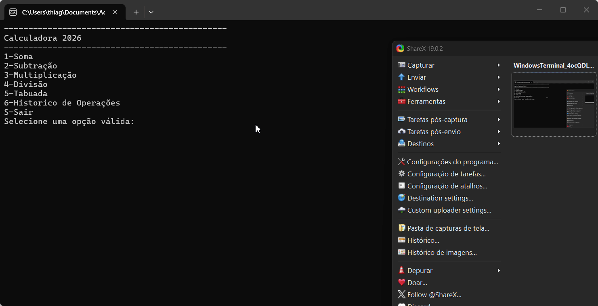

# Calculadora 2026



## Introdução

Uma calculadora de consolesimples mais poderosa que permita realizar as quatro operações matemáticas, além da visualização do historico de operações e tabuada

## Funcionalidades

- **Operações básicas**:realiza somas,subtrações,multiplicações e divisões com facilidade.
- **Tratamento de Divisão Zero**: A calculadora é capaz de validar erros de divisão por zero.
- **Tabuada**: A calculadora é capaz de gerar a tabuada de um número informado.
- **Histórico de operações**: A calculadora é capaz de armazenar um histórico das operações anteriores.

## Como utilizar o programa

1. Clone o repositório ou baixe o código comprimido em .zip.
2. Abra o emulador de terminal e navegue até a pasta raiz.
3. Utilize o comando abaixo para restaurar as dependencias do projeto

    ```
    dotnet restore
    ```
4. Em seguida compile e execute o projeto com o comando

    ```
    dotnet run --project Calculadora.Console.App
    ```
    
## Requisitos

    .NET SDK 10.0 